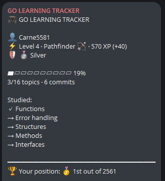
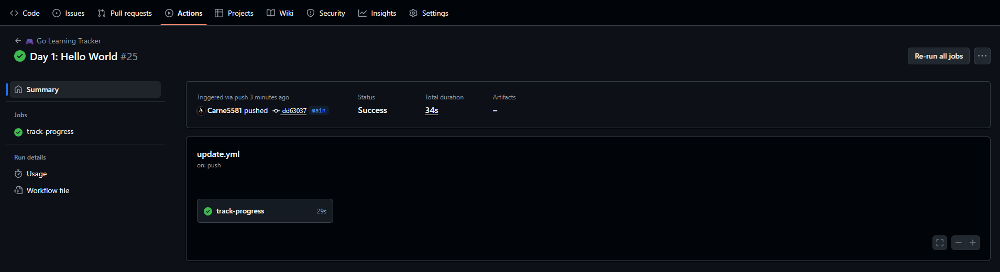
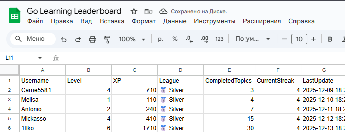

# 🎮 Go Learning Tracker Bot


> **Твой личный тренер для изучения Go с геймификацией, XP, достижениями и конкуренцией!**


---

## 🎯 Что это?

### 📱 Отчёты в Telegram


### 🤖 Автоматизация через GitHub Actions


### 🏆 Live Leaderboard


**Go Learning Tracker** — это автоматическая система отслеживания прогресса изучения Go с элементами игры:

### ✨ Основные фичи:
- 📊 **Умный анализ кода** — сканирует твои .go файлы и определяет изученные темы
- 💰 **XP система** — зарабатывай опыт за каждую изученную тему
- 🏆 **10 достижений** — разблокируй уникальные награды
- 🔥 **Streak система** — учись каждый день и получай бонусы
- ⚠️ **Штрафы** — теряй XP за пропуски (жёсткая мотивация!)
- 🎖️ **Лиги** — от Bronze до Diamond
- 📱 **Отчёты в Telegram** — красивые сообщения с прогрессом
- 🌍 **Общий Leaderboard** — соревнуйся с другими!
- 📈 **Автообновление badges** — твой прогресс всегда виден

---

## 🚀 Быстрый старт

### 1️⃣ Форкни репозиторий
Нажми **Fork** в правом верхнем углу ⭐

### 2️⃣ Создай Telegram бота

```
1. Открой @BotFather в Telegram
2. Отправь /newbot
3. Придумай имя: "My Go Tracker"
4. Скопируй токен: 1234567890:ABC...
```

### 3️⃣ Создай канал

```
1. Создай публичный канал в Telegram
2. Добавь бота как администратора
3. Узнай Chat ID через:
   https://api.telegram.org/bot<TOKEN>/getUpdates
```

### 4️⃣ Настрой секреты GitHub

```
Settings → Secrets and variables → Actions → New secret

Добавь 2 секрета:
├─ TELEGRAM_TOKEN = твой_токен_от_BotFather
└─ TELEGRAM_CHAT_ID = -1001234567890
```

### 5️⃣ Начни учиться!

```bash
# Создай свой первый Go файл
echo 'package main

import "fmt"

func main() {
    var name string = "Марсель"
    age := 25
    fmt.Println("Привет!", name, age)
}' > day-1-variables.go

# Закоммить и запушить
git add .
git commit -m "Day 1: Variables"
git push

# 🎉 Бот автоматически отправит отчёт в Telegram!
```

---

## 🎮 Геймификация

### 💰 XP Система

Зарабатывай опыт за всё:

| Действие | XP |
|----------|-----|
| Изучил новую тему Level 1 | +50 XP |
| Изучил новую тему Level 2 | +75 XP |
| Изучил новую тему Level 3 | +100 XP |
| Изучил новую тему Level 4 | +125 XP |
| Изучил новую тему Level 5 | +150 XP |
| Изучил новую тему Level 6 | +200 XP |
| Изучил новую тему Level 7 | +250 XP |
| Streak день | +20 XP |
| Разблокировал достижение | +100-2000 XP |

### ⚠️ Штрафы (жёсткая мотивация)

| Пропуск | Штраф |
|---------|-------|
| 1 день без коммита | -30 XP |
| 2 дня без коммита | -60 XP |
| 3 дня без коммита | -90 XP |
| Streak сбрасывается | 😢 |

### 🏆 Лиги

Поднимайся по лигам:

- 🥉 **Bronze League** — Level 1-2, 0-999 XP
- 🥈 **Silver League** — Level 3-4, 1000-1999 XP
- 🥇 **Gold League** — Level 5-6, 2000-2999 XP
- 💎 **Diamond League** — Level 7, 3000+ XP

### 🏅 Достижения

Разблокируй все 10:

| Иконка | Название | Условие | XP |
|--------|----------|---------|-----|
| 🎯 | Первый шаг | Первый коммит | +100 |
| 🔥 | Огненная неделя | 7 дней подряд | +300 |
| 💪 | Несгибаемый | 30 дней подряд | +1000 |
| 🥉 | Бронзовый воин | Level 3 | +200 |
| 🥈 | Серебряный мастер | Level 5 | +500 |
| 🥇 | Золотой гуру | Level 7 | +1000 |
| 🗺️ | Картограф | 10+ примеров maps | +250 |
| ⚡ | Повелитель потоков | Горутины + каналы | +400 |
| 🛡️ | Страж ошибок | 20+ обработок ошибок | +300 |
| 💯 | Центурион | 100 коммитов | +2000 |

---

## 📚 План обучения

### 🌱 Level 1: Новобранец (100 XP)
- ✅ Типы данных (int, float, string, bool)
- ✅ Переменные и константы

### ⚔️ Level 2: Подмастерье (225 XP)
- ⬜ Условия (if/else)
- ⬜ Циклы (for)
- ⬜ Switch

### 🗡️ Level 3: Искатель (200 XP)
- ⬜ Массивы и слайсы
- ⬜ Maps (карты)

### 🏹 Level 4: Следопыт (250 XP)
- ⬜ Объявление функций
- ⬜ Обработка ошибок

### 🔮 Level 5: Чародей (450 XP)
- ⬜ Структуры
- ⬜ Методы
- ⬜ Интерфейсы

### ⚡ Level 6: Архимаг (400 XP)
- ⬜ Горутины
- ⬜ Каналы

### 👑 Level 7: Великий Магистр (500 XP)
- ⬜ HTTP сервер
- ⬜ Тестирование

**Всего: 2125 XP** для прохождения всех тем!

---

## 🌍 Общий Leaderboard

### Как присоединиться к конкуренции:

1. **Настрой webhook** (опционально):
   ```
   Settings → Secrets → New secret
   Name: LEADERBOARD_WEBHOOK
   Value: https://your-leaderboard-api.com/submit
   ```

2. **Используй общий канал**:
   - Присоединяйся к официальному каналу: [@GoLearningBattle](https://t.me/your_channel)
   - Все участники видят рейтинг друг друга
   - Обновляется после каждого коммита

### 🏆 Топ участников:

| 🏅 | Имя | Level | XP | Streak | League |
|---|-----|-------|-----|--------|--------|
| 🥇 | Player1 | 7 | 4500 | 45 | 💎 Diamond |
| 🥈 | Player2 | 6 | 3200 | 30 | 🥇 Gold |
| 🥉 | Player3 | 5 | 2100 | 21 | 🥇 Gold |
| 4 | You | 1 | 0 | 0 | 🥉 Bronze |

*Обновляется автоматически*

---

## 📊 Пример отчёта

```
🎮 GO LEARNING TRACKER

👤 Carne5581
⚡ Level 2 · Подмастерье ⚔️ · 360 XP (+150)
🛡 🥉 Bronze

▰▰▰▱▱▱▱▱▱▱ 31%
5/16 тем · 12 коммитов

🔥 Огненная серия: 7 дней подряд — Отлично!

🎉 Новое достижение разблокировано!
🔥 Огненная неделя *(+300 XP)*

🎯 Следующая цель: Switch

Изучено:
  ✓ Типы данных
  ✓ Переменные и константы
  ✓ Условия (if/else)
  ✓ Циклы (for)
  → Switch

#golang #buildinpublic
```

---

## 🛠️ Кастомизация

### Изменить план обучения

Открой `notifier/main.go` и отредактируй `syllabus`:

```go
var syllabus = []Topic{
    {
        Level: 1, 
        Name: "Моя тема", 
        Keywords: []string{"keyword"}, 
        MinExamples: 3,
        XPReward: 100,
    },
}
```

### Добавить достижения

```go
var allAchievements = []Achievement{
    {
        ID: "my_achievement",
        Name: "Моё достижение",
        Description: "Описание",
        Icon: "🎉",
        XPReward: 500,
    },
}
```

### Локальный тест

```bash
# Запустить без отправки в Telegram
go run notifier/main.go
```

---

## 📁 Структура проекта

```
my-go-learning/
├── .github/
│   └── workflows/
│       └── update.yml          # GitHub Actions
├── notifier/
│   └── main.go                 # Основной код бота
├── basics/
│   ├── day-1-hello.go
│   ├── day-2-variables.go
│   └── day-3-types.go
├── .gitignore
├── README.md
├── ACHIEVEMENTS.md
├── stats.json                  # Создаётся автоматически
└── .completed_topics           # Создаётся автоматически
```

---

## 💡 Советы

### Для быстрого прогресса:
- 📝 **Пиши код каждый день** — даже 10 минут считаются!
- 🎯 **Фокусируйся на одной теме** — не распыляйся
- 💬 **Комментируй код** — это помогает запомнить
- 🔥 **Сохраняй streak** — ставь напоминания

### Для фарма XP:
- Создавай файлы с множеством примеров одной конструкции
- Например: `maps-practice.go` с 10+ примерами maps
- Это быстро даст тебе достижение "Картограф" 🗺️

### Для конкуренции:
- 👀 **Следи за leaderboard** — это мотивирует
- 🏆 **Ставь цели** — "хочу обогнать Player2 за неделю"
- 💪 **Не сдавайся** — даже если отстаёшь

---

## 🤝 Участие в проекте

Этот проект **полностью open-source**!

### Как помочь:
- ⭐ Поставь звезду на GitHub
- 🐛 Сообщи о багах (Issues)
- 💡 Предложи новые фичи
- 🔧 Сделай Pull Request
- 📢 Расскажи друзьям

### Идеи для развития:
- [ ] Ежедневные челленджи
- [ ] Турниры по темам
- [ ] Интеграция с Discord
- [ ] Графики прогресса
- [ ] Система рангов (Bronze I, Bronze II...)
- [ ] Титулы за достижения

---

## 📄 Лицензия

MIT License — используй как хочешь! 🎉

---

## 🙏 Благодарности

Сделано с ❤️ для всех, кто учит Go

**Присоединяйся к движению!** 🚀

#golang #learninpublic #100daysofcode #gamification

---

## 📞 Контакты

- 💬 Issues: [GitHub Issues](https://github.com/Carne5581/my-go-learning/issues)
- 📱 Telegram канал: [@go_tracker](https://t.me/go_tracker)
- 🌍 Leaderboard: [Google Sheets](https://docs.google.com/spreadsheets/d/YOUR_SHEET_ID)

**Happy coding!** 🎮